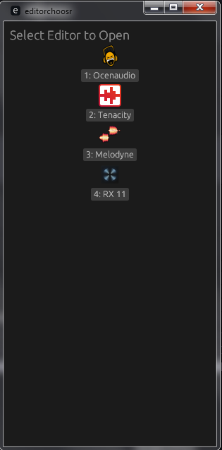

# editorchoosr
A way to select between many editors for programs that allow an external editor
Specifically, this was made for Ableton Live, where you can select an editor for audio files, but I wanted more than one.
Made in rust, because the first version (in autohotkey) didn't work, as the parent process exited, remove file access.
Currently windows-only, would love help for cross-platform.
The code might be clunky.

# usage
[Download here](https://github.com/jxqu3/editorchoosr/releases/tag/1.0)  
Set it as your programs external editor of choice, customize the config.yaml to your liking, and done!
To select an editor, click on its button, or press the number stated in its name!


# configuration
You need a `config.yaml` file in the same folder as the editor executable.
It is very simple:
```yaml
# you make a "editors" key,
editors:
  - name: 'Ocenaudio' # add a dash (-) for each editor, it's name, and it's path.
    path: 'C:\Users\chkmt\AppData\Local\ocenaudio\ocenaudio.exe'
  - name: 'Tenacity'
    path: 'C:\Program Files\Tenacity\Tenacity.exe'
```

